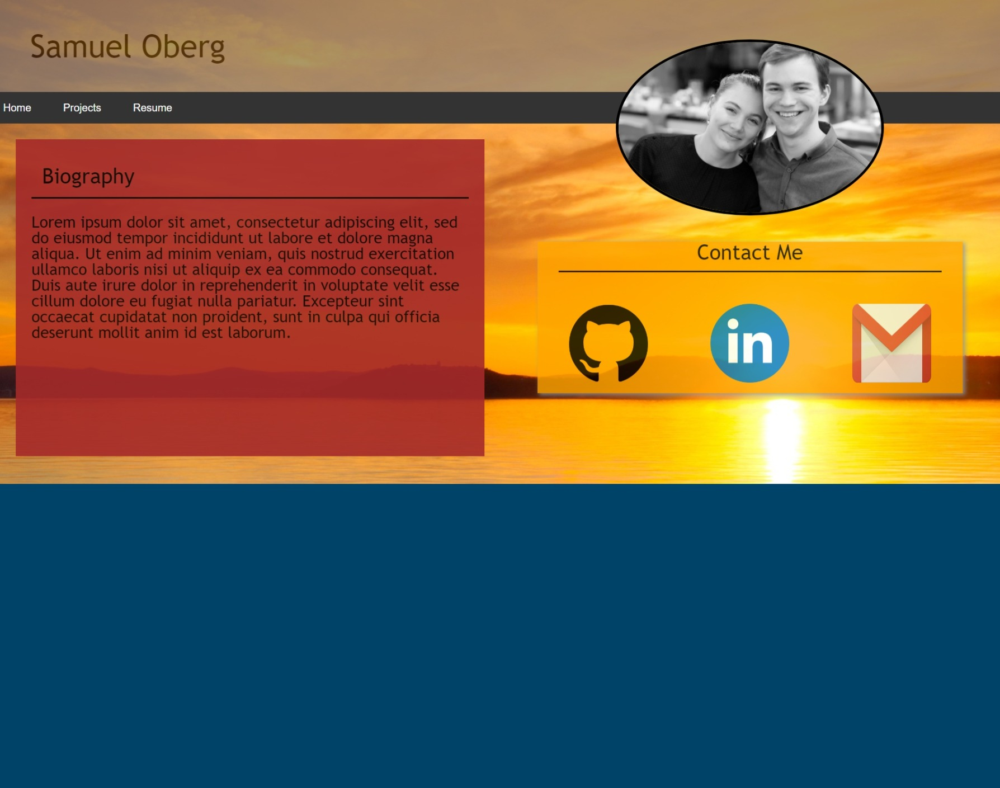

# updated_portfolio

## Description

This is my updated portfolio to display my most recent work in the UW coding bootcamp. I focused on using CSS for most of my animations on this page to learn more about cascading style sheets. 

## Usage

Click the link to our webpage: <https://sosoberg.github.io/updated_portfolio/>